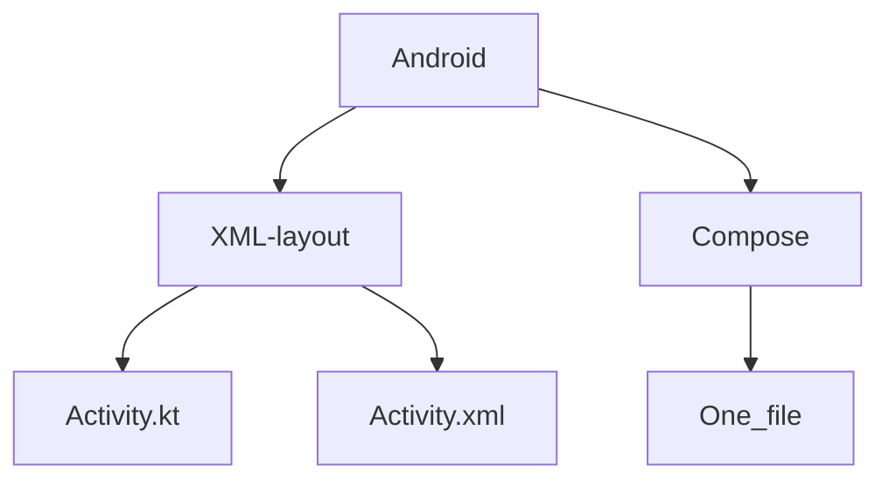

# Android Skill Track/Roadmap Update Guide
## Note 
> [!NOTE]
> This roadmap documentation is under works! 
> At the time of writing, 30/09/2023 @ 00:12 hours, Compose was stable and Android Studio Giraffe | 2022.3.1 is completely ready for Use! 

> [!WARNING]
> The roadmap and resources are under maintainence, the compose build system and toolset has  reached a canonically stable adoption.
> for example: The new Chat-GPT App uses Relay and jetpack compose extensively 

 
# Introduction to Android Skill Track/Roadmap Update

### 1. Greeting and Introduction

Hello everyone! Welcome to the exciting journey of enhancing your Android development skills. In this updated skill track, we will explore the evolving landscape of Android development, transitioning from traditional XML-based UI objects to the world of declarative UI with Android Compose and Relay.

### 2. Transition to Compose from XML-Based UI Objects
j

### Why Compose?
The modern Android Developemnt, brings a lot of features and Developer experience improvements, features such as composable funtions, reuasble UI componenets, State-recomposition. It also brings performance to table as for competitive development in competitions, native will be more practical in terms of 

#### Embracing the Future of UI Development

The Android ecosystem is undergoing a significant transformation. Google is leading the way by shifting from XML-based UI objects to a declarative UI paradigm with Android Compose. This evolution represents a fundamental change in how we create user interfaces for Android applications. It's a move from describing the "how" (imperative) to describing the "what" (declarative).

### 3. Introduction of Compose and Relay

#### Meet Android Compose

Android Compose is the cornerstone of this transformation. It's a modern UI toolkit that lets you build native Android interfaces declaratively. With Compose, you describe your UI based on the current state of your app, and the framework handles the rest. Compose empowers developers to create interactive, dynamic, and visually stunning UIs with less code and more flexibility.

#### The Role of Relay

In this journey, we'll also introduce you to Relay, which plays a vital role as an intersection of UI design and application design, relay helps you to bring your design assets straight from figma, directly to android studio and use it in your project as if they were standard material components 

### 4. Refreshed Skill Track

#### Why Update the Skill Track?

Our commitment to your growth as an Android developer drives us to update our skill track continually. This update will reflect the most up-to-date knowledgebase in Android development, aligning with the industry's evolving standards.

#### What to Expect

The refreshed skill track will encompass the latest tools, techniques, and best practices for Android development. It will guide you through the intricacies of Compose, Relay, and more, ensuring you're equipped to build exceptional Android applications.

### 5. Build-Up to Kotlin Multiplatform (KMM)

#### Meet Kotlin Multiplatform (KMM)

As we journey through the Android landscape, we'll also explore Kotlin Multiplatform (KMM). KMM is your ticket to writing shared code between Android and other platforms like iOS. It's a future-proofing strategy that broadens your horizons and opens new avenues for your career.

#### Diverse Opportunities

Mastering KMM allows you to explore diverse opportunities beyond Android development. You'll become a versatile developer, capable of contributing to cross-platform projects and expanding your skill set.

### 6. Industry Adoption and Demand

#### Industry Trends

The industry is already embracing Compose, Relay, and KMM. As these technologies gain traction, their demand is steadily increasing. Companies seek developers who can harness the power of these tools to build modern Android applications.

#### Career Advancement

By staying ahead of the curve and mastering Compose, Relay, and KMM, you position yourself for career advancement. Your expertise in these areas will be highly sought after as the demand vortex for these skills gradually intensifies.

### 7. Beta Status and Development

#### Our Commitment to Excellence

We want to be transparent about our skill track's status – it's currently in the BETA stage. Our commitment to excellence drives us to continuously develop and refine the content to provide you with the best learning experience.

#### Your Feedback Matters

Your feedback is invaluable to us. As we continue to develop this skill track, we encourage you to share your thoughts, questions, and suggestions. Together, we'll shape the future of Android development.

So, are you ready to embark on this journey? Let's dive into the world of Android Compose, Relay, KMM, and future-proof Android development together!
